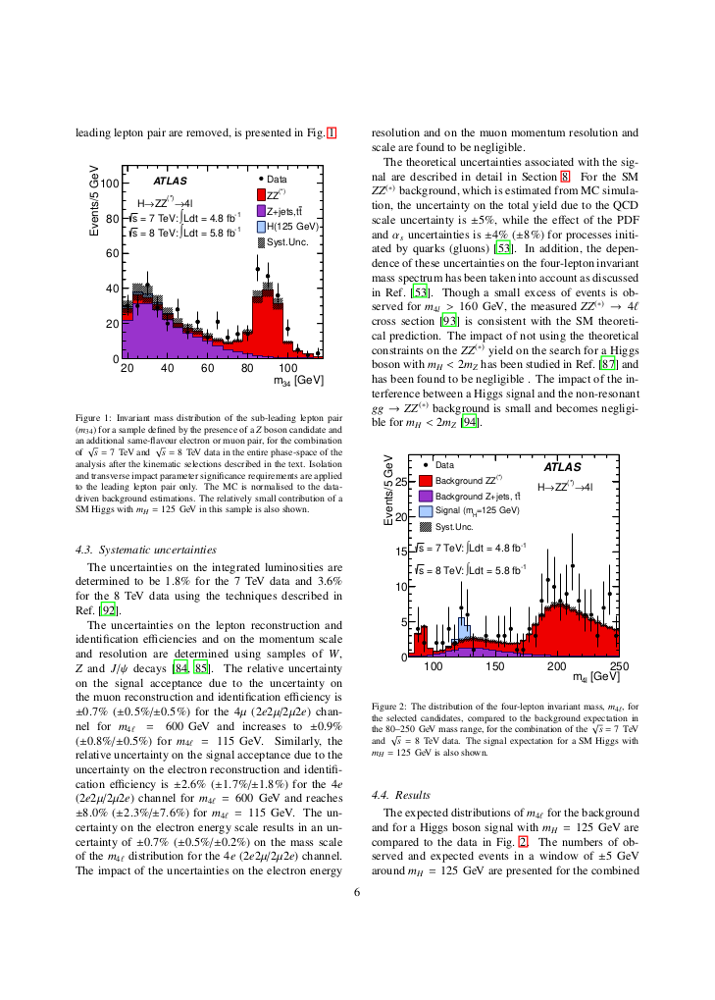
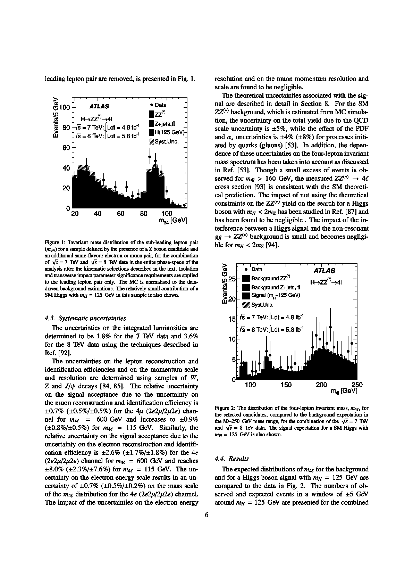
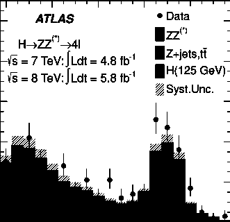
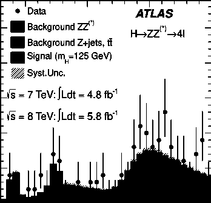

Work in progress!

# Intro
## Synopsis
CLI tool for indexing both plots and text in input PDFs (slides/papers) and then to search in them.

Plots are stored as hex-encoded code from bitmaps containing the most-relevant components of a discrete cosine transform of the original plot.
Hence, similar looking plots get assigned similar codes.
The search of a given plot in the index is performed by finding the hex code that is most similar (smallest hamming distance) to the code of the given plot.

# Example Usage

Index plots from input PDFs to output CSV index:
```
./plotgrep -o index.csv input_dir/*.pdf
```

Index text from input PDFs to output TXT:
```
 ./plotgrep -o index.txt input_dir/*.pdf
```

Search screen grab of plot in CSV index created above and others:
```
 ./plotgrep index.csv some_other_index_files/*.csv
```

Search text as regex in TXT index created above and others (not implemented yet):
```
 ./plotgrep index.txt some_other_index_files/*.txt
```

## Working principle
The following describes the process of indexing for example [this paper](https://arxiv.org/abs/1207.7214) (`higgs.pdf`):

```
./plotgrep -o index.csv higgs.pdf
```

Each page of a given PDF is first converted into a black and white bitmap:

<p align="center">
  
  
</p>

This example is page 7 of the given paper (the first one containing plots).

A pixel is assigned to be white if above and black if below a threshold of its grayscale brightness value.
The threshold is determined by the average brightness of all pixels in the page.

In each page bitmap the plots are identified as rectangles with a border containing exclusively black pixels (`bm_find_plots(...)` in `include/bitmap.h`):
* For each black pixel in the page the number of consecutive black pixels down and right of it are identified
* This allows to identify the largest possible rectangle with the starting pixel as top left corner.
* If this rectangle has a large enough area (identified as fraction of the page area) and reasonable aspect ratio (not one side being much larger than the other) it is identified as plot
In this case two plots are identified.
The black/white threshold is re-determined from the average brightness of each plot in order to get a better contrast:

<p align="center">
  
  
</p>

For each plot a discrete cosine transform is performed (`bm_discrete_cosine_transform(...)` in `include/bitmap.h`).
Only the first 16 components in x and y are calculated, resulting in a 16x16 bitmap:

<p align="center">
  
  
</p>

This represents 16x16 = bits which can be represented as 64 hex-encoded chars which yield the final code for each plot.
The code of each plot is stored in the output file `index.csv`:

```
0964F6A528128D687699090A72FDBC164786A9F9D62F21C255EF230E48A0633D,higgs.pdf,7,1
493E97E748BFE9003642C80037404EBA336454992B00D4ED4E94306F16BB78DC,higgs.pdf,7,2
```

When then searching for a plot based on a screen grab by:

```
./plotgrep index.csv
```

The same procedure is performed on the screen grab as described above for the PDF pages.
Each hex-code stored in `index.csv` is converted back into a 16x16 DCT bitmap which is compared to the 16x16 DCT bitmap of the plot in the screen grab.
For each, the amount of different bits is determined using the hamming distance.

The plot in `index.csv` with the smallest distance is selected and the paper which contained it is automatically opened at the page it was found in.

# Setup and Install

Prerequisite C libraries:
```
apt-get install libmupdf-dev ljbig2dec
ln -s /usr/lib/x86_64-linux-gnu/libopenjp2.so.2.3.1 /usr/lib/x86_64-linux-gnu/libopenjp2.so
ln -s /usr/lib/x86_64-linux-gnu/libjbig2dec.so.0 /usr/lib/x86_64-linux-gnu/libjbig2dec.so

```

Install:
```
make
```

For development, python prototyping tests (in `./prototyping/`):

```
pip install PyMuPDF
```

# Getting inputs

## Papers from arxiv
kaggle dataset with all arxiv papers: https://www.kaggle.com/datasets/Cornell-University/arxiv

Install gsutil:

```
sudo apt-get install apt-transport-https ca-certificates gnupg
echo "deb [signed-by=/usr/share/keyrings/cloud.google.gpg] https://packages.cloud.google.com/apt cloud-sdk main" | sudo tee -a /etc/apt/sources.list.d/google-cloud-sdk.list
curl https://packages.cloud.google.com/apt/doc/apt-key.gpg | sudo apt-key --keyring /usr/share/keyrings/cloud.google.gpg add -
sudo apt-get update && sudo apt-get install google-cloud-cli
```

To download a single paper:

```
mkdir axv
gsutil -m cp -r gs://arxiv-dataset/arxiv/arxiv/pdf/2402/ ./axv
```

## Slides from indico
Use [indicoscraper](https://github.com/tofitsch/indicoscraper)

# Notes and TODO for development
* Remove `-ggdb3` from Makefile once debugging done
* /mu
* Add multi-threading for mupdf: https://mupdf.com/docs/examples/multi-threaded.c

